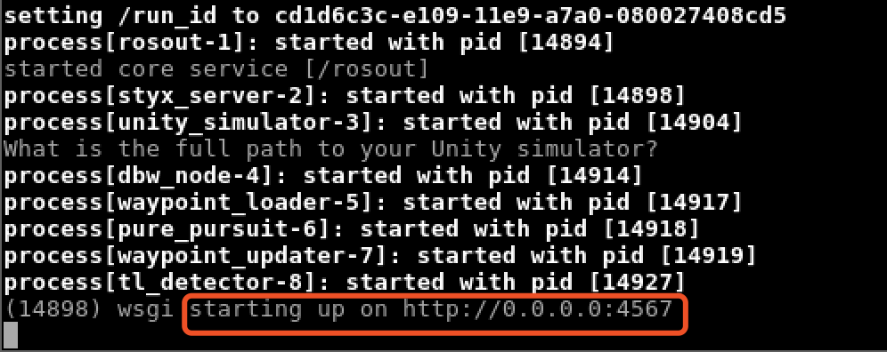
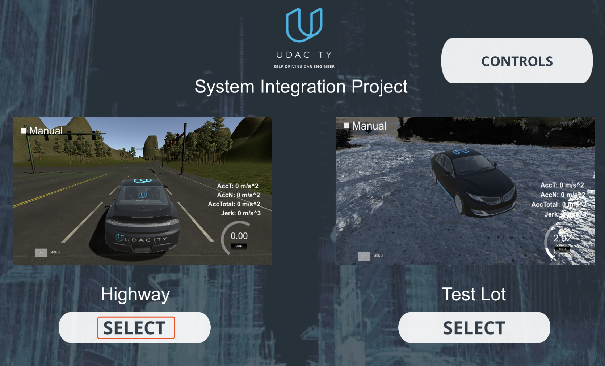
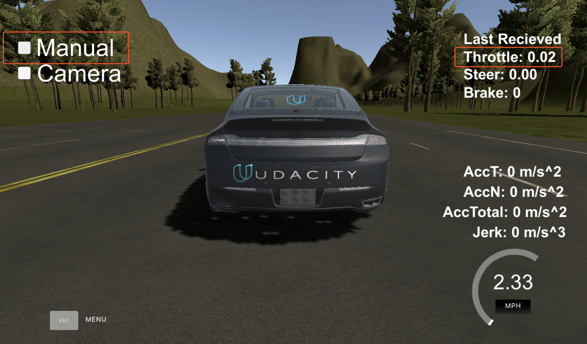

### Team Members

* Name:Wang Zhenguo(**Team leader**)
  Udacity Account Email: zhenguo.wang@daimler.com

* Name:Liu Chuanhao     
  Udacity Account Email: lch743@126.com

* Name:Zhu Minzheng  
  Udacity Account Email: minzheng.zhu@daimler.com

### Quick Setup for Env
#### 1. VirtualBox+Ubuntu

  [VirtualBox Link](https://www.virtualbox.org/)
  
  [ Udacity VM(Ubuntu) Link](https://s3-us-west-1.amazonaws.com/udacity-selfdrivingcar/Udacity_VM_Base_V1.0.0.zip)

#### 2. Simulator and set up sharing port
The system integration project uses its own simulator which will interface with your ROS code and has traffic light detection.[Simulator Link](https://github.com/udacity/CarND-Capstone/releases)
   
   Port forwarding is required when running code on VM and simulator on host.
For security reasons, the VM does not automatically open port forwarding, so you need to manually enable port 4567. This is needed for the C++ program to successfully connect to the host simulator.

Port Forwarding Instructions

* First open up Oracle VM VirtualBox

* Click on the default session and select settings.

* Click on Network, and then Advanced.

* Click on Port Forwarding

* Click on the green plus, adds new port forwarding rule.

* Add a rule that assigns 4567 as both the host port and guest Port, as in the screenshot.


#### 3. Clone the repertory
    git clone https://github.com/udacity/CarND-Capstone.git
#### 4. Python requirements set up
    cd CarND-Capstone
    pip install -r requirements.txt 
    
  Make sure all dependencies are installed successfully.This is one screenshot for example:
  
  
#### 5. Compile and run the code
    cd ros
    catkin_make
    source devel/setup.sh
    roslaunch launch/styx.launch
   
   Make sure the source code is correct if you made some change.This is one screenshot for example:
   
   

#### 6. Trouble Shooting
*  TypeError:unsupported operand type(s) for -=: 'Retry' and 'int'

   

   As I am located in China ,some website and source is unavailable for me,so need the source from tsinghua.
        
        cd CarND-Capstone.   
        pip install -r requirements.txt -i https://pypi.tuna.tsinghua.edu.cn/simple

#### 7. click the simulator in host 
Start the simulator in the host computer,click the SELECT button as shown.



Cancel the selection of Manual button,this will make the simulator works more smoothly.
At this moment,the vehicle will move at a very low speed.



From terminal in the Virtual Machine, there is accepted message pop-up.
 


By now, the development environment is successfully set up.
Let's move to the next parts.


### System Architecture Diagram

For this project, you'll be writing ROS nodes to implement core functionality of the autonomous vehicle system, including traffic light detection, control, and waypoint following! You will test your code using a simulator, and when you are ready, your group can submit the project to be run on Carla.
The following is a system architecture diagram showing the ROS nodes and topics used in the project. You can refer to the diagram throughout the project as needed. The ROS nodes and topics shown in the diagram are described briefly in the Code Structure section below, and more detail is provided for each node in later classroom concepts of this lesson.

### Order of Project Development
Because you will be writing code across several packages with some nodes depending on messages published by other nodes, we suggest completing the project in the following order:

##### Step 1
  * Waypoint Updater Node (Partial): Complete a partial waypoint updater which subscribes to /base_waypoints and /current_pose and publishes to /final_waypoints.
  
##### Step 2
* DBW Node: Once your waypoint updater is publishing /final_waypoints, the waypoint_follower node will start publishing messages to the/twist_cmd topic. At this point, you have everything needed to build the dbw_node. After completing this step, the car should drive in the simulator, ignoring the traffic lights.

##### Step 3
* traffic Light Detection: This can be split into 2 parts:
Detection: Detect the traffic light and its color from the /image_color. The topic /vehicle/traffic_lights contains the exact location and status of all traffic lights in simulator, so you can test your output.
Waypoint publishing: Once you have correctly identified the traffic light and determined its position, you can convert it to a waypoint index and publish it.

##### Step 4 
* Waypoint Updater (Full): Use /traffic_waypoint to change the waypoint target velocities before publishing to /final_waypoints. Your car should now stop at red traffic lights and move when they are green.

### Meet the final target step by step
In this section,we will follow the item 4 step by step and record what and how to do in order to meet the final target.If there is obvious latency when run the simulator, please try to cancel the label in the left of the Manual which means without manual control.


****  


This is the project repo for the final project of the Udacity Self-Driving Car Nanodegree: Programming a Real Self-Driving Car. For more information about the project, see the project introduction [here](https://classroom.udacity.com/nanodegrees/nd013/parts/6047fe34-d93c-4f50-8336-b70ef10cb4b2/modules/e1a23b06-329a-4684-a717-ad476f0d8dff/lessons/462c933d-9f24-42d3-8bdc-a08a5fc866e4/concepts/5ab4b122-83e6-436d-850f-9f4d26627fd9).

Please use **one** of the two installation options, either native **or** docker installation.

### Native Installation

* Be sure that your workstation is running Ubuntu 16.04 Xenial Xerus or Ubuntu 14.04 Trusty Tahir. [Ubuntu downloads can be found here](https://www.ubuntu.com/download/desktop).
* If using a Virtual Machine to install Ubuntu, use the following configuration as minimum:
  * 2 CPU
  * 2 GB system memory
  * 25 GB of free hard drive space

  The Udacity provided virtual machine has ROS and Dataspeed DBW already installed, so you can skip the next two steps if you are using this.

* Follow these instructions to install ROS
  * [ROS Kinetic](http://wiki.ros.org/kinetic/Installation/Ubuntu) if you have Ubuntu 16.04.
  * [ROS Indigo](http://wiki.ros.org/indigo/Installation/Ubuntu) if you have Ubuntu 14.04.
* [Dataspeed DBW](https://bitbucket.org/DataspeedInc/dbw_mkz_ros)
  * Use this option to install the SDK on a workstation that already has ROS installed: [One Line SDK Install (binary)](https://bitbucket.org/DataspeedInc/dbw_mkz_ros/src/81e63fcc335d7b64139d7482017d6a97b405e250/ROS_SETUP.md?fileviewer=file-view-default)
* Download the [Udacity Simulator](https://github.com/udacity/CarND-Capstone/releases).

### Docker Installation
[Install Docker](https://docs.docker.com/engine/installation/)

Build the docker container
```bash
docker build . -t capstone
```

Run the docker file
```bash
docker run -p 4567:4567 -v $PWD:/capstone -v /tmp/log:/root/.ros/ --rm -it capstone
```

### Port Forwarding
To set up port forwarding, please refer to the "uWebSocketIO Starter Guide" found in the classroom (see Extended Kalman Filter Project lesson).

### Usage

1. Clone the project repository
```bash
git clone https://github.com/udacity/CarND-Capstone.git
```

2. Install python dependencies
```bash
cd CarND-Capstone
pip install -r requirements.txt
```
3. Make and run styx
```bash
cd ros
catkin_make
source devel/setup.sh
roslaunch launch/styx.launch
```
4. Run the simulator

### Real world testing
1. Download [training bag](https://s3-us-west-1.amazonaws.com/udacity-selfdrivingcar/traffic_light_bag_file.zip) that was recorded on the Udacity self-driving car.
2. Unzip the file
```bash
unzip traffic_light_bag_file.zip
```
3. Play the bag file
```bash
rosbag play -l traffic_light_bag_file/traffic_light_training.bag
```
4. Launch your project in site mode
```bash
cd CarND-Capstone/ros
roslaunch launch/site.launch
```
5. Confirm that traffic light detection works on real life images

### Other library/driver information
Outside of `requirements.txt`, here is information on other driver/library versions used in the simulator and Carla:

Specific to these libraries, the simulator grader and Carla use the following:

|        | Simulator | Carla  |
| :-----------: |:-------------:| :-----:|
| Nvidia driver | 384.130 | 384.130 |
| CUDA | 8.0.61 | 8.0.61 |
| cuDNN | 6.0.21 | 6.0.21 |
| TensorRT | N/A | N/A |
| OpenCV | 3.2.0-dev | 2.4.8 |
| OpenMP | N/A | N/A |

We are working on a fix to line up the OpenCV versions between the two.
